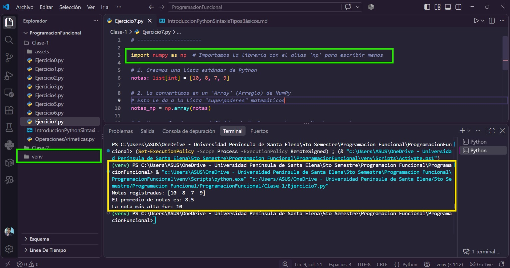

# **Estructuras de datos básicas**:

- **Listas (`list`)**: Colecciones ordenadas y **mutables** (pueden cambiar sus elementos).
    
    ```python
    planetas: list[str] = ["Mercurio", "Venus", "Tierra"]
    planetas.append("Marte")
    ```
    
- **Tuplas (`tuple`)**: Colecciones ordenadas e **inmutables** (ideales para datos que no deben modificarse, como coordenadas).
    
    ```python
    punto_origen: tuple[int, int, int] = (0, 0, 0)
    ```
    
- **Diccionarios (`dict`)**: Colecciones basadas en pares **clave-valor**.
    
    ```python
    curso: dict[str, any] = {"nombre": "Python", "creditos": 5}
    ```
    

# **Bibliotecas**:

- **Uso de `import`**:
    - Permite reutilizar código existente. Se puede importar un módulo completo (**`import math`**)
        
        ```python
        import math # Biblioteca para funciones matemáticas
        ```
        
    - Usar un apodo o alias (**`import numpy as np`**),
        
        ```python
        import numpy as np # np es el alias estándar para numpy
        ```
        
    - Traer funciones específicas (**`from math import pow`**).
        
        ```python
        from os import path # os es la biblioteca para interactuar con el sistema operativo
        ```
        

# **Flujo de control**:

- **Condicionales e Indentación**: Evaluaciones con `if`, `elif` y `else`. En Python la lógica dentro de una estructura se define por la sangría/espacios y no por llaves.
    
    ```python
    temperatura: int = 35
    if temperatura > 35:
        print("Es un día caluroso.")
    elif temperatura > 20:
        print("El clima es templado.")
    else:
        print("Hace frío, ¡a abrigarse!")
    ```
    
- **Bucles `for`**: Utilizados para recorrer elementos de cualquier colección.
    
    ```python
    planetas: list[str] = ["Mercurio", "Venus", "Tierra", "Marte", "Júpiter", "Saturno", "Urano", "Neptuno"]
    
    for planeta in planetas:
        print(f"Explorando {planeta}...")
        print("")
        
    ```
    

# **Funciones:**

- **Definición de Funciones**: Se declaran con `def`. Como buenas prácticas del curso, especificamos el tipo de los parámetros de entrada y el tipo de retorno usando la flecha **`->`**
    
    ```python
    def saludar():
     print("¡Hola, bienvenido/a!")
    saludar() # Llamada a la función
    Parte 2: Explicación de los Ejercicios 2 (Diccionario y NumPy)
    ```
    
- **Parámetros y Retorno:**
Las funciones pueden recibir datos (**`parámetros`**) y devolver un resultado (**`return`**).
    
    ```python
    def calcular_area_rectangulo(base: float, altura: float) -> float:
        area = base * altura
        return area
    
    area_calculada = calcular_area_rectangulo(10.5, 5)
    print(f"El área es: {area_calculada}")
    ```
    

---

# Como usar **`numpy`**:

1. **Abre tu terminal en la carpeta del proyecto:**
    
    Asegúrate de que tu PowerShell esté ubicado en la ruta principal de tu proyecto:
    
2. **Crea el entorno virtual:**
    
    Ejecuta el siguiente comando para crear una carpeta llamada `venv` (puedes ponerle otro nombre si deseas) que contendrá tu entorno aislado:
    
    ```powershell
    python -m venv venv
    ```
    
3. **Activa el entorno virtual:**
    
    Específico para PowerShell en Windows. Activa el entorno para que las instalaciones se guarden allí y no en tu sistema global:
    
    ```
    .\venv\Scripts\Activate.ps1
    ```
    
    > **Nota importante:** Si al ejecutar este comando PowerShell te muestra un error en rojo diciendo que "la ejecución de scripts está deshabilitada", ejecuta primero este comando: `Set-ExecutionPolicy Unrestricted -Scope CurrentUser`, presiona "S" para aceptar, y luego vuelve a intentar activar el entorno.
    > 
    
4. **Instala la biblioteca NumPy:**
    
    Sabrás que el entorno está activado porque verás el texto `(venv)` al inicio de tu línea de comandos. Ahora sí, instala la librería:
    
    ```
    pip install numpy
    ```
    
5. **Ejercicio**: 
    
    ```python
    # ---------------------
    
    import numpy as np  # Importamos la librería con el alias 'np' para escribir menos
    
    # 1. Creamos una lista estándar de Python
    notas: list[int] = [10, 8, 7, 9]
    
    # 2. La convertimos en un 'Array' (Arreglo) de NumPy
    # Esto le da a la lista "superpoderes" matemáticos
    notas_np = np.array(notas)
    
    # 3. Usamos funciones predefinidas de NumPy para ahorrar cálculos manuales
    media = np.mean(notas_np)        # Calcula el promedio automáticamente
    nota_maxima = np.max(notas_np)   # Encuentra el valor más alto de la lista
    
    print(f"Notas registradas: {notas_np}")
    print(f"El promedio de notas es: {media}")
    print(f"La nota más alta fue: {nota_maxima}")
    ```
    
6. **Ejecuta tu programa:**
    
    Con el entorno activado y NumPy instalado correctamente, ejecuta tu archivo:
    
    ```
    python Ejercicio7.py
    ```
    
    
    