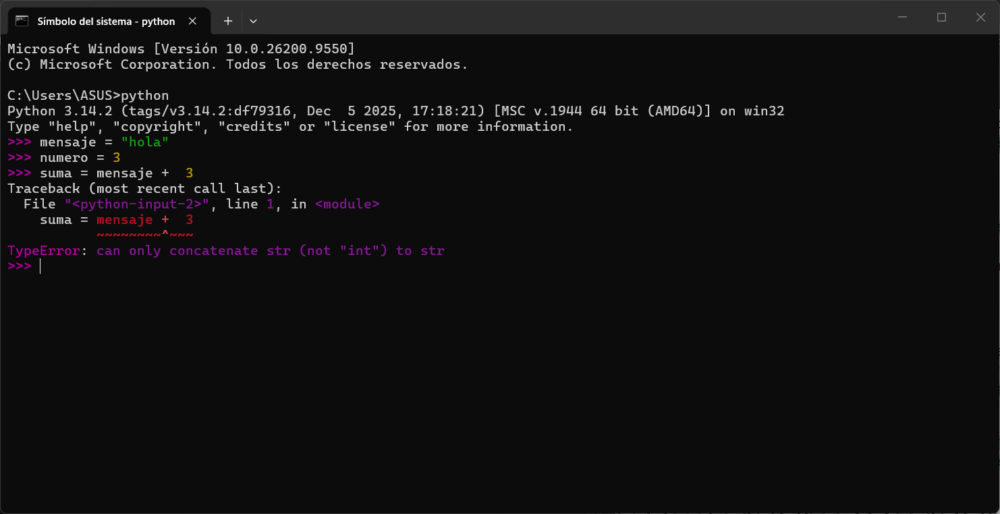

# ¿Qué es Python?

Es un lenguaje de programación de alto nivel su sintaxis es más cercana al lenguaje humano que al lenguaje de máquina, Es fácil de leer y escribir en comparación con lenguajes de más bajo nivel como C o Ensamblador.

## Características:

- Es un lenguaje interpretado: No necesita un paso de compilación para convertir todo el código a lenguaje maquina antes de ejecutarlo. Cuenta con un intérprete que lee el código línea por línea y lo ejecuta en tiempo real.
- Tipado dinámico: No se necesita declara explícitamente el tipo de dato de una variable, Python lo infiere en la ejecución.
    
    ```python
    edad = 25  #Python sabe que edad es un numero entero (int)
    ```
    
- Tipado Fuerte: Aunque el tipo se asigne de forma dinamica, Python es estricto en como se usan los tipos, por ejemplo:
    
    ```python
    mensaje = "hola"
    numero = 3
    suma = mensaje + 3
    ```
    
    
    

---

# El Zen de Python:

El Zen de Python es una colección de 19 principios y filosofías de diseño creados por Tim Peters para guiar la escritura de código legible y limpio en el lenguaje Python. 

## Cómo ver el Zen de Python

- Abre la terminal o consola de comandos.
- Escribe el comando import this.
- Presiona Enter para mostrar los aforismos en pantalla.


<details>
<summary><strong>Zen en español</strong></summary>

1. Hermoso es mejor que feo.
2. Explícito es mejor que implícito.
3. Simple es mejor que complejo.
4. Complejo es mejor que complicado.
5. Plano es mejor que anidado.
6. Disperso es mejor que denso.
7. La legibilidad cuenta.
8. Los casos especiales no son lo suficientemente especiales como para romper las reglas.
9. Aunque la practicidad supera a la pureza.
10. Los errores nunca deberían pasar en silencio.
11. A menos que se silencien explícitamente.
12. Ante la ambigüedad, rechaza la tentación de adivinar.
13. Debería haber una -y preferiblemente solo una- manera obvia de hacerlo.
14. Aunque esa manera puede no ser obvia al principio a menos que seas holandés.
15. Ahora es mejor que nunca.
16. Aunque nunca es a menudo mejor que justo ahora.
17. Si la implementación es difícil de explicar, es una mala idea.
18. Si la implementación es fácil de explicar, puede que sea una buena idea.
19. Los espacios de nombres son una idea genial, ¡hagamos más de esos!

</details>

---

# La Importancia de las Pistas de Tipo (Type Hints)

Aunque Python tiene tipado dinámico, a partir de la versión 3.5 se introdujeron las pistas de tipo (type hints). Estas son anotaciones opcionales que puedes agregar a tu código para indicar el tipo de dato esperado para una variable o el que retorna una función.

```python
nombre: str = "Ronald Parraga"
edad: int = 19
es_programador: bool = True
```

- **Claridad y Documentacion:** el codigo es mas facil de entender para otros desarrolladores.

> 💡 **Idea clave**
>
> Usar pistas de tipo es una práctica moderna y muy recomendada para escribir código robusto y profesional.

---

# Print(), Variables y Tipos de Datos Primitivos:

> 💡 **Importante**
>
> La función **`print()`** es fundamental. Nos permite mostrar en la consola el valor de una variable, un texto o el resultado de una operación.

Una variable es un contenedor con un nombre donde almacenamos un valor. En esta clase, nos centraremos en los tipos de datos más básicos:

- **`int (Entero):`** Números enteros, sin decimales. Ej: 10, -5, 0.
- **`float (Flotante):`** Números con decimales. Ej: 3.14, -0.001, 2.7182.
- **`str (Cadena de texto):`** Secuencias de caracteres, siempre entre comillas (simples ' o dobles "). Ej: "Python", 'Hola'.
- `bool (Booleano):` Representa uno de dos valores: True o False. Es la base de la lógica en programación.

---