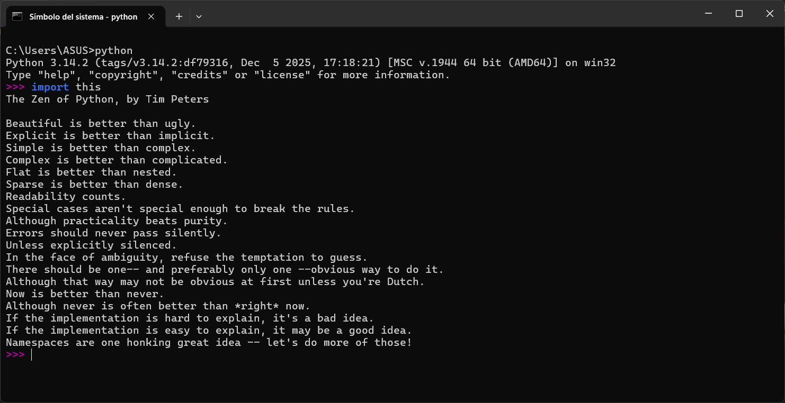

<div align="center">

# 🐍 Introducción a Python: Sintaxis y Tipos Básicos

### Semana 1 · Guía Fundamental · Conceptos Clave del Lenguaje

[](README.md)
[](3-IntroduccionPythonSintaxisTiposBásicos.md)
[](2-EstructurasFlujoFuncionesBibliotecas.md)
[](Tarea1-EjerciciosconPython2/README.md)

<br>


**Fundamentos de Python: características del lenguaje, el Zen de Python,**
**sistema de tipos de datos primitivos y buenas prácticas con Type Hints.**

</div>

> [!IMPORTANT]
> Python es un lenguaje de **tipado dinámico** pero **fuertemente tipado**. El uso de *Type Hints* (anotaciones de tipo) es una buena práctica imprescindible para escribir código legible, documentado y seguro.

## 🧭 Contenido

- [🎯 Objetivo](#-objetivo)
- [🧩 ¿Qué es Python?](#-qué-es-python)
  - [Características principales](#-características)
- [🧘 El Zen de Python](#-el-zen-de-python)
- [🏷️ La Importancia de las Pistas de Tipo (Type Hints)](#️-la-importancia-de-las-pistas-de-tipo-type-hints)
- [🖨️ Print(), Variables y Tipos de Datos Primitivos](#️-print-variables-y-tipos-de-datos-primitivos)
- [🧭 Navegación entre Guías](#-navegación-entre-guías)
- [📫 Contacto](#-contacto)

---

## 🎯 Objetivo

Conocer los conceptos elementales de la sintaxis de Python, entender el funcionamiento de su tipado en tiempo de ejecución, internalizar la filosofía de diseño del Zen de Python y aprender a documentar código mediante anotaciones de tipos estáticas.

---

## 🧩 ¿Qué es Python?

Es un lenguaje de programación de alto nivel cuya sintaxis es mucho más cercana al lenguaje humano que al lenguaje de máquina. Es fácil de leer y escribir en comparación con lenguajes de más bajo nivel como C o Ensamblador.

### ⚙️ Características:

- **Es un lenguaje interpretado:** No necesita un paso de compilación previo para convertir todo el código a lenguaje máquina antes de ejecutarlo. Cuenta con un intérprete que lee el código línea por línea y lo ejecuta en tiempo real.
- **Tipado dinámico:** No se necesita declarar explícitamente el tipo de dato de una variable en memoria; Python lo infiere automáticamente durante la ejecución.
    
    ```python
    edad = 25  # Python infiere automáticamente que edad es un entero (int)
    ```
    
- **Tipado fuerte:** Aunque el tipo se asigne de forma dinámica, Python no realiza conversiones implícitas peligrosas entre tipos incompatibles:
    
    ```python
    mensaje = "hola"
    numero = 3
    # suma = mensaje + 3  # ❌ TypeError: can only concatenate str to str
    ```
    
    <div align="center">
      
    </div>

---

## 🧘 El Zen de Python

El Zen de Python es una colección de 19 principios y filosofías de diseño creados por **Tim Peters** para guiar la escritura de código legible, elegante y limpio en Python.

### 💻 Cómo ver el Zen de Python en consola:

1. Abre tu terminal o consola de comandos.
2. Escribe el comando:
   ```python
   python -c "import this"
   ```
3. Presiona **Enter** para mostrar los aforismos en pantalla.

<div align="center">
  
</div>

<details>
<summary>👉 <strong>Desplegar: Los 19 principios del Zen en español</strong></summary>

1. Hermoso es mejor que feo.
2. Explícito es mejor que implícito.
3. Simple es mejor que complejo.
4. Complejo es mejor que complicado.
5. Plano es mejor que anidado.
6. Disperso es mejor que denso.
7. La legibilidad cuenta.
8. Los casos especiales no son lo suficientemente especiales como para romper las reglas.
9. Aunque la practicidad supera a la pureza.
10. Los errores nunca deberían pasar en silencio.
11. A menos que se silencien explícitamente.
12. Ante la ambigüedad, rechaza la tentación de adivinar.
13. Debería haber una —y preferiblemente solo una— manera obvia de hacerlo.
14. Aunque esa manera puede no ser obvia al principio a menos que seas holandés.
15. Ahora es mejor que nunca.
16. Aunque nunca es a menudo mejor que justo ahora.
17. Si la implementación es difícil de explicar, es una mala idea.
18. Si la implementación es fácil de explicar, puede que sea una buena idea.
19. Los espacios de nombres son una idea genial, ¡hagamos más de esos!

</details>

---

## 🏷️ La Importancia de las Pistas de Tipo (Type Hints)

A partir de la versión 3.5, Python introdujo formalmente las **pistas de tipo** (*Type Hints*, PEP 484). Son anotaciones que indican el tipo de dato esperado para una variable o el valor devuelto por una función:

```python
nombre: str = "Ronald Parraga"
edad: int = 19
es_programador: bool = True
```

> [!TIP]
> **Beneficios clave:**
> - **Claridad y auto-documentación:** El código se comprende de inmediato sin tener que rastrear de dónde proviene cada variable.
> - **Detección temprana de errores:** Herramientas como `mypy` o el propio autocompletado del IDE detectan inconsistencias antes de ejecutar el programa.

---

## 🖨️ Print(), Variables y Tipos de Datos Primitivos

> [!NOTE]
> La función nativa **`print()`** es la herramienta básica para mostrar en consola el valor de cualquier variable, texto formateado o resultado de una operación.

Una variable es un identificador que apunta a un valor en memoria. En este inicio de curso trabajamos con los tipos más elementales:

| Tipo | Clase en Python | Descripción | Ejemplo |
|:---:|:---:|---|---|
| **Entero** | `int` | Números enteros positivos o negativos, sin decimales | `10`, `-5`, `0` |
| **Flotante** | `float` | Números con parte decimal | `3.14`, `-0.001`, `2.7182` |
| **Cadena** | `str` | Secuencias ordenadas de caracteres de texto | `"Python"`, `'Hola Mundo'` |
| **Booleano** | `bool` | Valor lógico de verdad: `True` o `False` | `True`, `False` |

---

## 🧭 Navegación entre Guías

<div align="center">

| ⬅️ Anterior | 🏠 Menú Principal | Siguiente ➡️ |
| :---: | :---: | :---: |
| [🏠 Semana 1: README](README.md) | [📚 Índice de Semana 1](README.md) | [2. Estructuras, Flujo y NumPy ➡️](2-EstructurasFlujoFuncionesBibliotecas.md) |

</div>

---

## 📫 Contacto

- 💼 **LinkedIn:** [David Parraga Mendoza](https://www.linkedin.com/in/davidparragamendoza/)
- 𝕏 **X:** [@DavidParragaMen](https://x.com/DavidParragaMen)

<div align="center">

✨ **Gracias por visitar este proyecto** ✨

</div>